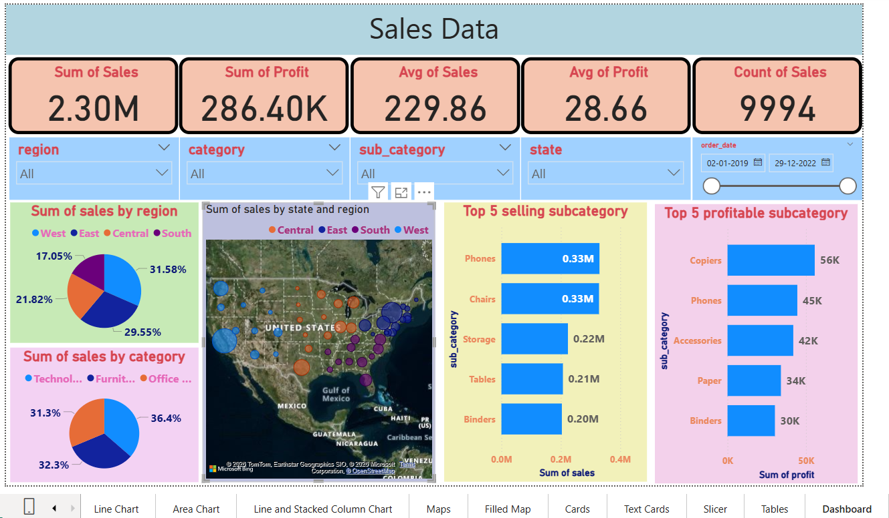

# 📊 Sales Dashboard - Power BI

## 📌 Project Overview
This project is an interactive Sales Dashboard developed using Microsoft Power BI. It helps analyze sales performance, profit trends, regional sales, product categories, and key business KPIs through interactive visualizations.

## 🛠️ Tools Used
- Microsoft Power BI
- Microsoft Excel
- Power Query
- DAX

## 📸 Dashboard Preview

## 📈 Dashboard Features
- Total Sales
- Total Profit
- Average Sales
- Average Profit
- Sales Count
- Sales by Region
- Sales by Category
- Sales by State (Map)
- Top 5 Selling Subcategories
- Top 5 Profitable Subcategories
- Interactive Filters (Region, Category, State, Date)

## 💡 Key Insights
- West region generated the highest sales.
- Phones and Chairs were among the top-selling products.
- Copiers generated the highest profit.
- Interactive slicers help analyze data dynamically.

## 📂 Project Files
- 📊 Sales Dashboard.pbix
- 📄 Orders_data.xlsx
- 🖼️ Dashboard.png

## 👨‍💻 Author
**Anand Kumar Shukla**

Aspiring Data Analyst

**Skills:** SQL | Python | Power BI | Excel | Tableau

📧 Email: anandkumarshukla2002@gmail.com

🔗 LinkedIn: https://linkedin.com/in/anandkrshukla
